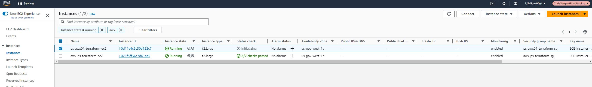
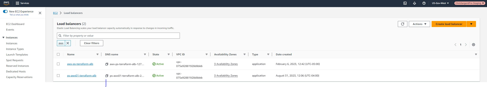

* This repository contains detailed instructions for deploying a RHEL 8 AWX EC2 instance using Terraform in PreStaging. The deployment includes creating EC2 instances, Application Load Balancer (ALB), Security Groups (SG) for EC2 and ALB, managing certificates, and setting up a target group. Once the infrastructure is in place, the guide will walk you through the process of deploying AWX on the EC2 instance deployed via Terraform. For any additional details or inquiries, please contact us at c.sargent-ctr@ecstech.com.
# [AWX Project Page](https://github.com/ansible/awx)
* Note AWX is the opensourced Ansible Automation Platform
# [Ansible Automation Plaform](https://www.redhat.com/en/technologies/management/ansible)

# Clone project and terraform deploy from psansible
1. ssh christopher.sargent@ansible-lb-prestaging-db5f707613698434.elb.us-gov-west-1.amazonaws.com
2. cd /home/christopher.sargent/ && git clone https://bitbucket.cdmdashboard.com/projects/DBOPS/repos/ps_awx_rhel8_stigd_ami.git
3. cd ps_awx_rhel8_stigd_ami && vim providers.tf
```
# Playground
provider "aws" {
  region = var.selected_region
  access_key = var.aws_access_key
  secret_key = var.aws_secret_key
}
```
4. vim ECE-Installer-20200811_010627.pem
```
# ECE-Installer-20200811_010627.pem key is in AWS secrets manager in playground. Cut and paste key into this file and save
```
5. chmod 400 ECE-Installer-20200811_010627.pem
6. vim variables.tf
```
#PreStaging terraform_service_user aws_access_key and aws_secret_key is in AWS secrets manager

variable "aws_access_key" {
  type    = string
  default = "" # specify the access key
}

variable "aws_secret_key" {
  type    = string
  default = "" # specify the secret key
}

variable "selected_region" {
  type    = string
  default = "us-gov-west-1" # specify the aws region
}

variable "ssh_private_key" {
  default         = "ECE-Installer-20200811_010627.pem"
  description     = "ECE-Installer-20200811_010627"
}

variable "vpc_id" {
  description = "The ID of the VPC"
  type        = string
  default     = "vpc-id"
}

variable "allowed_ssh_cidr" {
  description = "CIDR block for SSH access"
  type        = list(string)
  default     = ["76.182.164.220/32", "10.100.0.0/24"]
}

variable "allowed_alb_ingress_cidr" {
  description = "CIDR block for ALB ingress"
  type        = list(string)
  default     = ["76.182.164.220/32"]
}

variable "subnets" {
  description = "List of subnets for ALB and EC2"
  type        = list(string)
  default     = ["subnet-id1", "subnet-id2", "subnet-id3"]
}

variable "alb_certificate_arn" {
  description = "ARN of the ACM certificate for ALB"
  type        = string
  default     = "arn:aws-us-gov:acm:us-gov-west-1:arnofcert"
}

variable "instance_type" {
  description = "EC2 instance type"
  type        = string
  default     = "t2.large"
}

variable "kms_key_id" {
  description = "KMS Key ID for EBS volume encryption"
  type        = string
  default     = "arn:aws-us-gov:kms:us-gov-west-1:arnofkmskey"
}
```
7. terraform init && terraform plan --out awx01.out
8. terraform apply "awx01.out"
9. https://console.amazonaws-us-gov.com > EC2 > search for awx and verify ps-awx01-terraform-ec2 instance is up



10. https://console.amazonaws-us-gov.com > Load Balancers > search for awx-pg-terraform-alb and get DNS name



# Terraform destroy if needed
* Note. This is only if AWX is no longer needed.
1. ssh christopher.sargent@ansible-lb-prestaging-db5f707613698434.elb.us-gov-west-1.amazonaws.com
2. cd /home/christopher.sargent/ps_awx_rhel8_stigd_ami
3. terraform destroy
